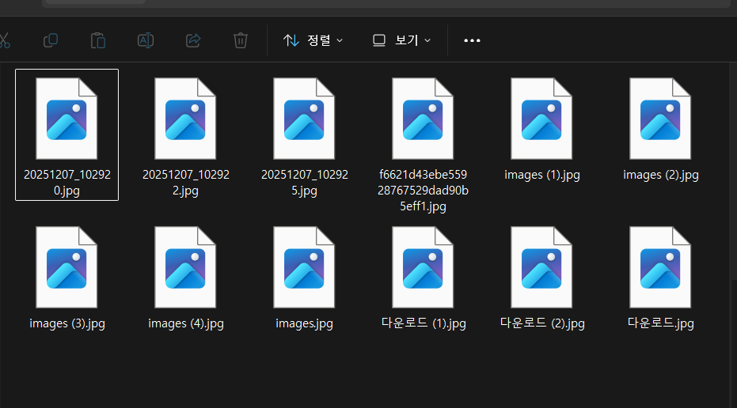
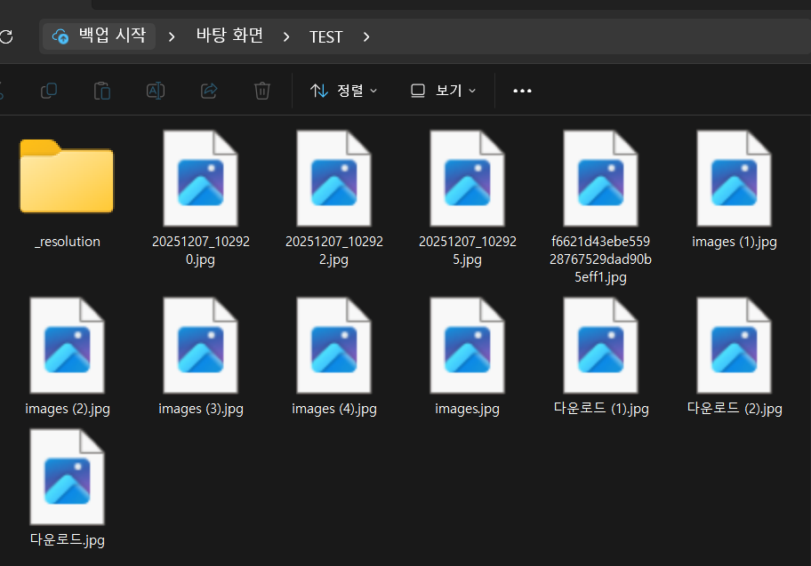
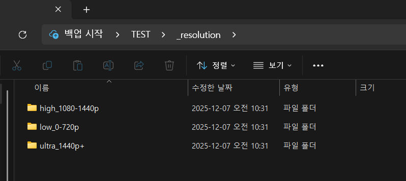
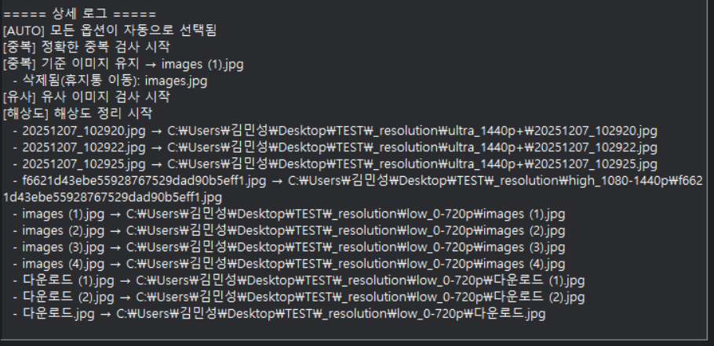

# 📂 Image Organizer  
Duplicate / Similar / Resolution-based Image Sorting Tool

## 📘 Overview
Image Organizer는 이미지가 많이 저장된 폴더를 자동으로 분석하고 정리해주는 데스크탑 애플리케이션입니다.  
중복 / 유사 / 해상도 분류 등을 GUI 기반으로 간편하게 처리할 수 있도록 설계되었습니다.

일부 코드 구성 및 리팩터링에는 ChatGPT 등의 AI 개발 도구를 참고하여 작업했습니다.

---

## ✨ Features

### ✔ 정확한 중복 이미지 제거  
SHA256 해시 기반으로 완전히 동일한 이미지를 식별하고  
대표 이미지 1개만 남기며 나머지는 `_removed_duplicates` 폴더로 이동합니다.

### ✔ 유사 이미지 그룹화  
pHash 기반으로 시각적으로 비슷한 이미지를 감지하여  
`_similar/group_X` 폴더로 복사합니다.

### ✔ 해상도 자동 분류  
이미지의 해상도를 기준으로 다음과 같이 자동 분류합니다:
- low_0-720p  
- mid_720-1440p  
- high_1440-2880p  
- ultra_2880p+

### ✔ GUI 이미지 정리 기능  
- 폴더 선택  
- 이미지 목록 자동 로딩  
- 클릭 시 미리보기  
- 정리 로그 출력  

### ✔ 안전한 동작  
- 정리는 복사 기반 → 원본 유지  
- 옵션별 기능 개별 실행 가능  

---

## 🖼 Screenshots
  
- 실행 시 ui 모습

- 정리 전 폴더 예시

- 정리 후 폴더 예시

- 정리된 폴더 내용

---

## 🔧 Tech Stack

| Category | Technology |
|---------|------------|
| Language | Python 3.x |
| GUI | Tkinter |
| Image Processing | Pillow, imagehash |
| File Handling | pathlib, shutil |
| Hashing | SHA256, pHash |

---

## 📦 Installation

리포지토리를 클론합니다:

    git clone https://github.com/YourName/ImageOrganizer.git
    cd ImageOrganizer

필요 라이브러리를 설치합니다:

    pip install -r requirements.txt

---

## ▶ Usage

GUI 실행:

    python gui.py

폴더 선택 → 옵션 체크 → "정리 실행" 버튼 클릭으로 정리가 진행됩니다.

---

## 📁 Project Structure

    📦 ImageOrganizer
     ┣ 📂 src
     │  ┣ img_organizer.py       # 이미지 정리 핵심 로직
     │  ┣ file_utils.py          # 파일 복사/삭제 유틸
     ┣ gui.py                    # GUI 프로그램 실행 파일
     ┣ requirements.txt
     ┗ README.md

---

## 🔍 Example Log Output

  

---

## 📜 License
MIT License 적용.

---

## 🙌 Acknowledgements
이 프로젝트는 ChatGPT 등 AI 도구의 도움을 받아  
코드 구조 개선, 디버깅, 예외 처리 보완 등의 과정을 거쳐 완성되었습니다.
